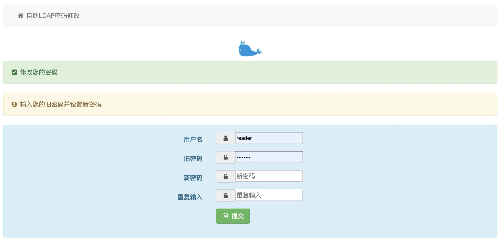

<!--
 * @Author: 以谁为师
 * @Website: attacker.club
 * @Date: 2020-04-10 11:19:39
 * @LastEditTime: 2020-04-15 00:13:06
 * @Description:
 -->

# ldap-password

## 介绍

自助修改 ldap 用户密码

### 环境


### 安装教程

Docker 部署

```shell

docker run --restart=always -d -p 8000:8000 --env LDAP_HOST="192.168.1.250" --env LDAP_ADMIN_USER="root.ops.net" --env LDAP_PASSWORD="PASSWD" --name ldap-password lghost/ldap-password:latest

# LDAP_HOST 是 ldap 服务器地址； LDAP_ADMIN_USER 是 manager 账号; LDAP_PASSWORD 是 manager 密码

```

**调试打印输出**
`docker -it -p 8000:8000 -rm ...省略`

> Django version 3.0.5, using settings 'website.settings' \
> Starting development server at <http://0.0.0.0:8000/> \
> Quit the server with CONTROL-C\
> [10/Apr/2020 00:09:49] "GET / HTTP/1.1" 200 4824\
> LDAP connect success! \
> [10/Apr/2020 00:09:58] "POST / HTTP/1.1" 200 18\
> LDAP connect success!\
> user: test modify passwd success

### 本地部署

```shell

git clone https://gitee.com/attacker/ldap-password.git
pip install -i http://mirrors.aliyun.com/pypi/simple --trusted-host mirrors.aliyun.com requirements.txt

python manage.py runserver 0.0.0.0:8000

# 启动服务

```

### 使用说明

<http://127.0.0.1:8000>

<!---->


---

扫码加入 **运维大本营**


## License

项目基于 GPLv3 协议， 详细请参考 [LICENSE](LICENSE) 。
